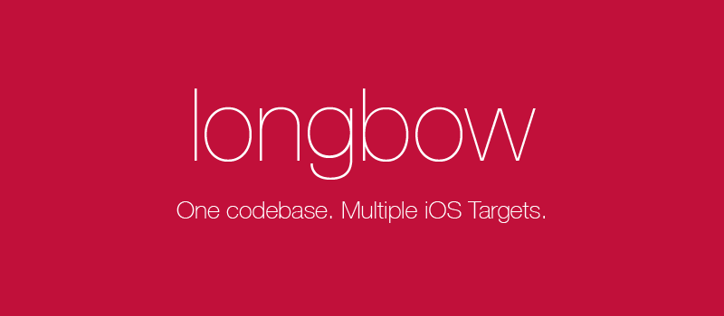

**Problem**

One codebase. Multiple App Store submissions with different icons, info.plist keys, etc.

**Solution**

```
longbow install
longbow shoot
```

**About**

Longbow duplicates the main target in your `.xcworkspace` or `.xcodeproj` file, then reads from a JSON file to fill out the rest of your target. It looks for certain keys and creates such things like taking an icon image and resizing it for the various icons you'll need, and adding keys to the info.plist file for that target. The goal was to be practically autonomous in creating new targets and apps.

**Requirements**

Longbow requires Xcode 5+, and your app must use the new .xcassets paradigm for icons, launch screens, etc.

## Table of Contents

* [Installation](#installation)
* [Set Up](#set-up)
* [Formatting longbow.json](#formatting-longbow-json)
* [Create a Target](#create-a-target)
* [Global Options](#global-options)
* [Contributing](#contributing)

## Installation

Add this line to your application's Gemfile:

    gem 'longbow'

And then execute:

    $ bundle

Or install it yourself as:

    $ gem install longbow

## Set Up

Run `longbow install` in the directory where your `.xcworkspace` or `.xcodeproj` file lives. This will create a file, `longbow.json`, where they will be used to build out from here. You are almost ready to start creating new targets

## Formatting .longbow.json

Here's a basic gist of how to format your `longbow.json` file:

```
{
	"targets":[
		{
			"name":"TargetName",
			"icon_url":"https://somewhere.net/img.png",
			"info_plist": {
        		"CFBundleIdentifier":"com.company.target1",
            	"ProprietaryKey":"Value"
      		}
		},
		{
			"name":"TargetName2",
			"icon_path":"/relative/path/to/file.png",
			"info_plist": {
        		"CFBundleIdentifier":"com.company.target2",
            	"ProprietaryKey":"Value2"
      		}
		}
	],
 	"global_info_keys":{
 		"somekey":"somevalue"
 	},
    "devices":["iPhone","iPad"]
}
```

In the top-level of the JSON file, we have 3 key/value pairs:

* `targets`
* `devices`
* `global_info_keys`

The `targets` section contains nested key/value pairs for each specific target. Each target can contain the following keys:

* `icon_url` or `icon_path`
* `info_plist`
* `name`

The `icon_url` and `icon_path` key corresponds to the location of the icon image. It will be downloaded from the web if necessary, then resized depending on your device setting and added to the Images.xcassets file for that target. The `info_plist` key corresponds to another set of key/value pairs that will be added or updated in the info.plist file specifically for this target.

## Creating/Updating a Target

Now that you're set up - it's time to add a target. Make sure that you have updated your `longbow.json` file with the correct information for your target, and then run the following command inside the project directory.

`longbow shoot -n NameOfTarget`

What this does is goes to your `.longbow.json` file and looks for json{"targets"}{"NameOfTarget"} and tries to create a new Target in your app, and handles the various icons/info_plist additions specifically for this target. If your target already exists, it will just update the icon images and plist settings.

If you leave off the `-n` option, it will run for all targets in the `.longbow.json` file.

**Other Options**

* `-d, --directory` - if not in the current directory, specify a new path

`longbow shoot -n NameOfTarget -d ~/Path/To/App`

## Global Options

`--dontlog` will not log the status/operations to the console.

`--help` will fill you in on what you need to do for an action.

## Contributing

1. Fork it
2. Create your feature branch (`git checkout -b my-new-feature`)
3. Commit your changes (`git commit -am 'Add some feature'`)
4. Push to the branch (`git push origin my-new-feature`)
5. Create new Pull Request
